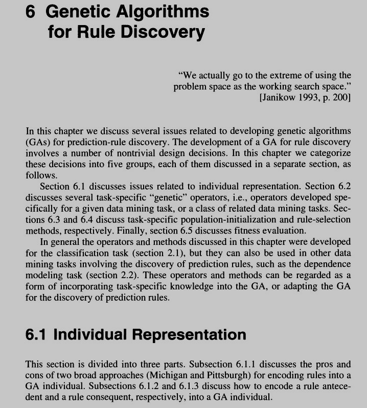
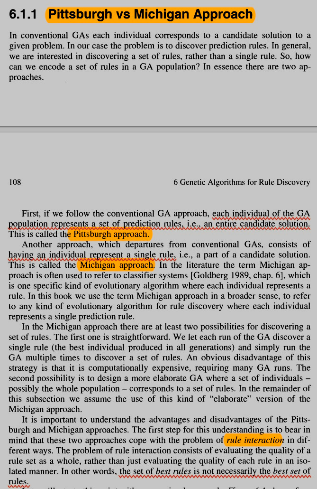
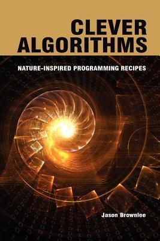
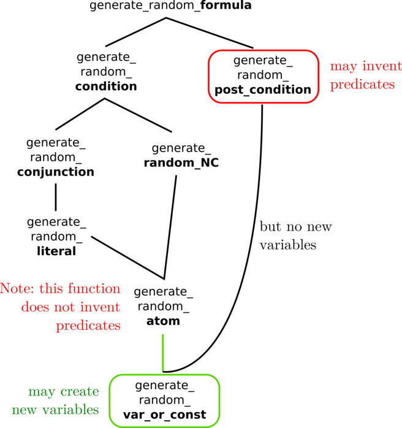
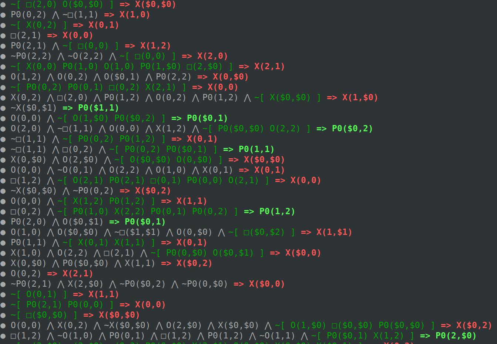
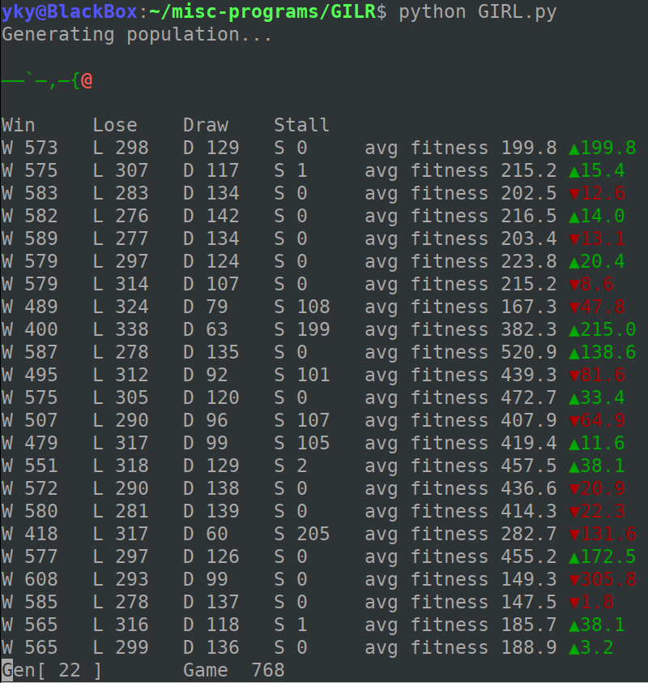
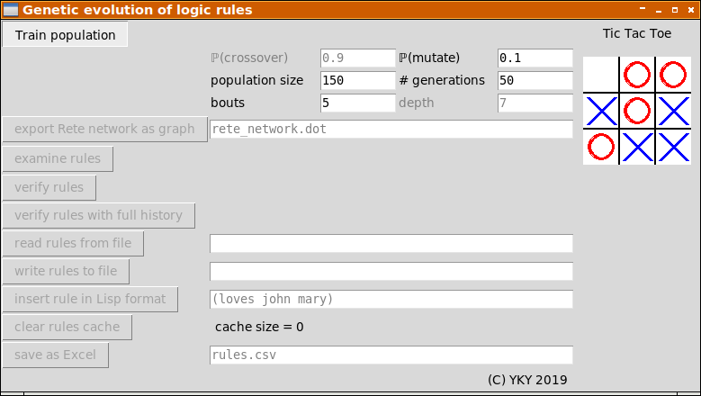

# GIRL

[0. Introduction](https://github.com/Cybernetic1/GIRL#0-introduction) 

[1. Genetic Algorithm](https://github.com/Cybernetic1/GIRL#1-genetic-algorithm)

 * Pittsburgh vs Michigan approach
 * Standard Evolutionary Algorithm
 * Structure of the Genome
 * Code borrowed from...
 
[2. Evolution of Logic Rules](https://github.com/Cybernetic1/GIRL#2-evolution-of-logic-rules)

* Structure of a Rule
* Flow Chart for Generating Random Logic Formulas
* Scoring of Rules
* Score Update from the Reinforcement-Learning Perspective
* Running the Code
* Why It Fails to Converge?

[3. Rete algorithm](https://github.com/Cybernetic1/GIRL#3-rete-algorithm)

* Understanding Rete
* How to run the Rete tests
 
[4. Graphical Interface for Tic Tac Toe](https://github.com/Cybernetic1/GIRL#5-graphical-interface-for-tic-tac-toe) 

## 0. Introduction

GIRL = **G**enetic **I**nduction of **R**elational **R**ules.

This is my attempt to use genetic programming to learn first-order logic rules to solve the game of Tic Tac Toe. 

It also makes use of the **Rete** production system for logic inference.

So far it has not been successful in solving Tic Tac Toe, but I think it's getting close &#128578;

## 1. Genetic Algorithm

### Pittsburgh vs Michigan approach

My algorithm is special in that it evolves an entire **set** of logic rules to play a game, where each rule has its own fitness value.  This is called the "**Michigan**" approach.  See the excerpt below:

### Standard Evolutionary Algorithm

* Initialize population
* Repeat until success:
    - Select parents
    - Recombine, mutate
    - Evaluate
    - Select survivors

### Structure of the Genome

 * The genome is a set of rules, which evolve co-operatively.
 * Each candidate = just one rule.
 * Each rule = [ head => tail ]
 * Heads and tails are composed from "var" symbols and "const" symbols.
 * Rules have variable length, OK?
     - as long as their lengths can decrease during learning

### Code borrowed from...

This very simple genetic programming demo is translated from Ruby to Python from the book _Clever Algorithms_ by Jason Brownlee:

Run via (note: always use Python3):

    python genetic_programming_[original-demo].py

This code is the **predecessor** of my code.

## 2. Evolution of Logic Rules

### Structure of a Rule

 * pre-condition => post-condition
 * pre-condition = list of positive/negative atoms, followed by an NC part
 * NC = NC[ list of atoms... ]
 * post-condition = just one positive atom
 * literal = atomic proposition optionally preceded by a negation sign

### Flow chart of logic formula generation

This flow chart helps to understand the code in `GIRL.py`:

### Scoring of Rules

 * For each generation, rules should be allowed to fire plentifully
 * Some facts lead to rewards
 
In *Clara Rules* (not used here), chains of inference can be inspected.

### Score Update from the Reinforcement-Learning Perspective

* For each inferred post-cond, the rule.fire += ε
* Then for each time step, the "fire" values of every rule **amortize**.
* At the time of **reward**, we reward all rules that has recently fired.
* A question is: If a rule recently fired, but has no influence on the rewarded rule?
* The point is: at least I can more easily detect the antecedents during backward chaining.
* Another problem: what about instantiations? So the "fire" should be recorded as instantiated **post-conds** of a rule.
* Recording all instantiations of post-conds may be costly but there seems no other alternatives.

Another question is how to express the **Bellman Condition** or update formula.

* The "state" would be the WM for each inference step.
* The "action" would be the inference post-cond.
* So the Bellman condition says: V(x) = Expect[ R +  γ V(x') ]
* which means we have to establish a value function over the **states** x = WM contents.
* But this is different from value functions over **rules**.
* The rules are more like **actions** taking a state to a new state.
* So how come I am evaluating actions instead of states?
    - Perhaps it is a kind of Q-learning?  Q(a|x).
    - Bellman update formula:  V(x) += η[ R + γ V(x') - V(x) ]
    - for Q-learning:  Q(x,a) += η[ R + γ max Q(x',a') - Q(x,a) ]
    - for SARSA: Q(x,a) += η[ R + γ Q(x',a') - Q(x,a) ]

### Running the GIRL Code

You can try the current version:

    python GIRL.py

The randomly generated logic rules are like this, for example:

where

* grey = conjunction
* green = negated conjunction
* red = conclusion

### Why It Fails to Converge?

The current algorithm _fails_ to converge for Tic-Tac-Toe:

Failure is probably because the current algorithm performs only 1 inference step per game move.  I predict that Tic-Tac-Toe can be solved once we have **multi-step** inference.

## 3. Rete algorithm

Rete is like a minimalist logic engine.  The version we use here is called NaiveRete, from Github:

https://github.com/GNaive/naive-rete

Here are some demos:

    python genifer.py
    python genifer_lover.py

You can also look into the `tests` directory for examples.

Rete is a notoriously complicated algorithm, although its basic idea is simple:  compile logic rules into a decision-tree-like network, so that rules-matching can be performed efficiently.

This is an example of a Rete network (with only 1 logic rule):

The PhD thesis [[Doorenbos 1995].PDF](basic_Rete_algorithm_[Doorenbos1995].pdf) is also included in this repository.  It explains the basic Rete algorithm very clearly and provides pseudo-code.  NaiveRete is based on the pseudo-code in this paper, in particular Appendix A.

There is also a paper, originally in French, which explains Rete in more abstract terms, which I partly translated into English: [[Fages and Lissajoux 1992].PDF](Fages_Lissajoux1992.pdf).

The original NaiveRete code has a few bugs that I fixed with great pain, and with the help of Doorenbos' thesis.

### How to run the Rete tests

Install PyTest via:

    pip3 install pytest

And then:

    python -m pytest test/*_test.py

## 4. Graphical Interface for Tic Tac Toe

The GUI is like this:

It requires **PyGame**:

    sudo apt install python3-pygame

I will prepare a version that does not use a graphic interface.
